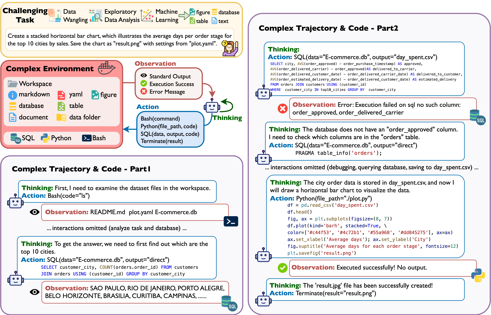

# [EMNLP 2024]DA-Code: Agent Data Science Code Generation Benchmark for Large Language Models

## Overview



## ⚙️ Quickstart

### Install Docker

Our agent and experiments need to run in a sandbox environment using Docker, so please follow the instructions in the [Docker setup guide](https://docs.docker.com/engine/install/) to install Docker on your machine.

### Install required packages

```bash
pip install -r requirements.txt
```

### Set LLM API Key

```bash
export AZURE_API_KEY=your_azure_api_key
export AZURE_ENDPOINT=your_azure_endpoint
export OPENAI_API_KEY=your_openai_api_key
export GEMINI_API_KEY=your_genmini_api_key
```

### Run the benchmark

```bash
python run.py
```

Arguments:

- `--max_steps`: Maximum number of steps (default is 20)
- `--max_memory_length`: Maximum length of memory to retain (default is 15)
- `--suffix`: Suffix for the filename (default is an empty string)
- `--model`: Model to use for the benchmark (default is "gpt-4")
- `--temperature`: Sampling temperature (default is 0.0)
- `--top_p`: Top p sampling parameter (default is 0.9)
- `--max_tokens`: Maximum number of tokens per generation (default is 1500)
- `--stop_token`: Token that triggers stop in generation (default is None)
- `--task_config`: Path to the meta configuration file (default is "da_code/configs/examples.jsonl")
- `--source_dir`: Directory for source files (default is "da_code/source")
- `--example_index`: Index range of the examples to run (default is "all")
- `--example_name`: Name of the example to run (default is an empty string)
- `--overwriting`: Enables overwriting existing files (default is False)
- `--retry_failed`: Retry failed evaluations (default is False)
- `--output_dir`: Directory for output files (default is "output")

### Evaluate the benchmark

```bash
python evaluate.py \
    --output_dir output/gpt4turbo \
    --gold_dir da_code/gold \
    --eval_json da_code/configs/eval/all.jsonl \
    --result_file results/gpt4.json \
    --timeout_seconds 300
```

Arguments:

- `--output_dir`: Directory for output files
- `--gold_dir`: Directory for gold files
- `--eval_json`: Path to the evaluation configuration file
- `--result_dir`: Directory to save the evaluation results
- `--timeout_seconds`: Timeout in seconds for each evaluation

### Get Full Dataset

We provide 100 examples of the dataset in the source folder. To get the full dataset, follow the instructions below:

* Download the **source data** from [here](https://drive.google.com/file/d/1eM_FVT1tlY4XXp6b7TrKzgTWOvskrjTs/view?usp=sharing)

  > You can also use `gdown` liberay to download the gold data:
  > First, `pip install gdown`
  > Then, run command `gdown "https://drive.google.com/uc?id=1ZGi0iNv797OneK_b2l2thJCulP6NUf7v" -O source.zip`
  >
* Unzip the dataset to da_code/source

```bash
unzip source.zip -d da_code/source
```

* Download the **gold data** from [here](https://drive.google.com/file/d/1WxcrijbCgdHzFSSSt2HVlkJqQrBWQ2IL/view?usp=sharing)

  > You can also use `gdown` liberay to download the gold data:
  > First, `pip install gdown`
  > Then, run command `gdown "https://drive.google.com/uc?`
  >
* Unzip the gold data to da_code/gold

```bash
unzip gold.zip -d da_code/gold
```

## BibTex

```
@misc{huang2024dacodeagentdatascience,
      title={DA-Code: Agent Data Science Code Generation Benchmark for Large Language Models}, 
      author={Yiming Huang and Jianwen Luo and Yan Yu and Yitong Zhang and Fangyu Lei and Yifan Wei and Shizhu He and Lifu Huang and Xiao Liu and Jun Zhao and Kang Liu},
      year={2024},
      eprint={2410.07331},
      archivePrefix={arXiv},
      primaryClass={cs.CL},
      url={https://arxiv.org/abs/2410.07331}, 
}
```
